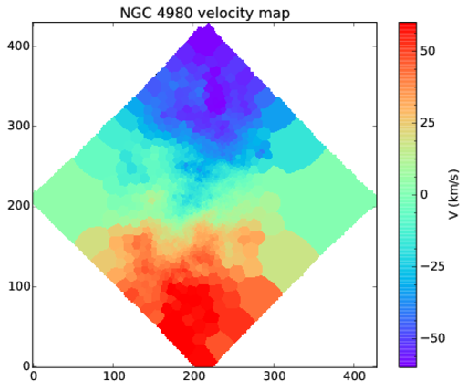
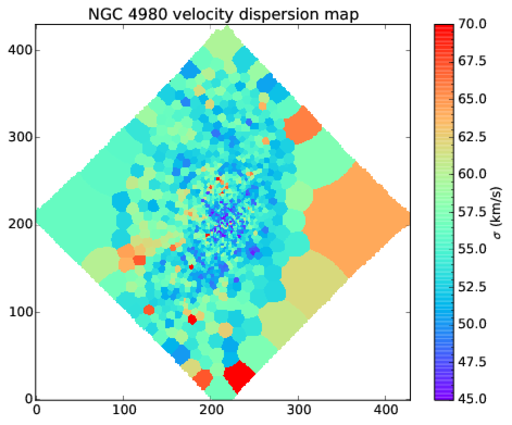

# Emission line fitting

## Continuum subtraction

Continuum based on the pPXF best-fit can be subracted from the Voronoi-binned spectra as follows.

```python
from pyezmad.voronoi import subtract_ppxf_continuum_simple

ppxf_npy_dir = 'pp_npy_out_sn50'
ppxf_npy_prefix = 'ngc4980_pp'
voronoi_binspec_file = 'ngc4980_voronoi_stack_spec_sn50.fits'
outfile = 'ngc4980_voronoi_stack_sn50_emspec.fits'

wave, var, flux, header = \
    subtract_ppxf_continuum_simple(voronoi_binspec_file,
                                   ppxf_npy_dir, ppxf_npy_prefix, outfile)
```

This create `ngc4980_voronoi_stack_sn50_emspec.fits` which has the identical format
to the input Voronoi-binned spectra.  Note that the wavelength range not fit by
the pPXF run are filled with `np.nan`.


## Fitting

Each emission line is assumed to be expressed as a Gaussian.

```
from pyezmad.emission_line_fitting import emission_line_fitting

linelist_name = [['Hbeta', 'OIII4959', 'OIII5007'], # these 3 lines are fit together
                 ['NII6548', 'NII6583', 'Halpha'],
                 ['SII6717', 'SII6731']]

voronoi_binspec_file = '../ppxngc4980_voronoi_stack_sn50_emspec.fits'
ppxf_output_file = 'ngc4980_ppxf_vel_sn50.fits'
outfile = 'ngc4980_voronoi_out_emprop_sn50.fits'

tbhdulist = emission_line_fitting(voronoi_binspec_file,
                                  ppxf_output_file,
                                  outfile,
                                  linelist_name,
                                  is_checkeach=False)
```

Emission lines grouped with a square bracket are fit simulataneously
assuming common line-of-sight velocity and velocity dispersion. 
Therefore, emission lines must always be grouped even for a single line fitting.
If you want to fit a single line, the line list should be like `linelist_name=[['Halpha']]`.

If you want to check each fitting, just set `is_checkeach=True`.

Currently, the following line names are supported, but it's very easy to extend.
```python
# pyezmad/utilities.py
linelist = {'OII3726'  : 3727.09,
            'OII3729'  : 3729.88,
            'H12'      : 3751.22,
            'H11'      : 3771.70,
            'H10'      : 3798.98,
            'H9'       : 3836.48,
            'NeIII3869': 3869.81,
            'H8'       : 3890.15,
            'NeIII3967': 3968.53,
            'Hepsilon' : 3971.19,
            'Hdelta'   : 4102.92,
            'Hgamma'   : 4341.69,
            'Hbeta'    : 4862.69,
            'OIII4959' : 4960.30,
            'OIII5007' : 5008.24,
            'NII6548'  : 6549.84,
            'NII6584'  : 6585.23,
            'Halpha'   : 6564.61,
            'SII6717'  : 6718.32,
            'SII6731'  : 6732.71,
            'NII5755'  : 5756.24,
            'OIII4363' : 4364.44,
            'OI6300'   : 6302.04,
            'HeI3889'  : 3889.75,
            'HeI5876'  : 5877.30,
            'HeI6678'  : 6679.996,
            # duplicated keys...
            'NII6583'  : 6585.23
            }
```


## Output file (complicated...)

The output file `'ngc4980_voronoi_out_emprop_sn50.fits` has a bit complicated format
(any suggestion for improvement is welcome!).
In each extension stores the result for one of emission line groups.
In the above example, there are three extensions named `GROUP0`, `GROUP1`, and `GROUP2`.
The first extension (`GROUP0`) stores the fitting result for the first emission line group.
Available keys are `f_<line>` and `ef_<line>` as flux and error in flux for each line,
common velosity and sigma with correponding errors (`vel`, `sig`, `errvel`, and `errsig`).
Information on the continuum (assumed to be 2nd order polynomial) are also stored
as `cont_a`, `cont_b`, and `cont_c`, and
the continuum can be reprodudec with `cont_a * x**2 + cont_b * x + cont_c`.
Chi-square and reduced chi-square are available as `chisqr` and `redchi`.

Yes, it's complicated, but I made a funciton to know which keys you should look at
to extract proper information.

```python
from pyezmad.emission_line_fitting import search_lines

hdu = fits.open('ngc4980_voronoi_out_emprop_sn50.fits')
extname, keyname = search_lines(hdu, ['Hbeta', 'OIII5007', 'Halpha', 'NII6583'])
```
With these infomation, you can obtain, for example, Halpha flux
with `hdu[extname['Halpha']].data['f_Halpha']`.


There resulting velocity field is the following.


__Velocity map__




  
__Velocity dispersion map__


