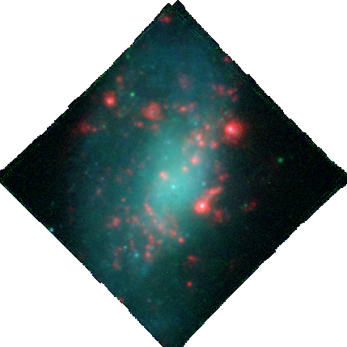

# Narrow-band image

You can extract narrow-band image by taking the effect of velocity and velocity dispersion into account.

```python
import astropy.io.fits as fits
from pyezmad.utilities import create_narrowband_image

infile = '/net/astrogate/export/astro/shared/MAD/MUSE/P95/reduceddata/NGC4980/NGC4980_FINAL.fits'

# make Halpha and [OIII]5007 narrow-band image
ha_img = create_narrowband_image(fits.open(infile),
                                 wcenter=6564.61,
                                 dw=None,
                                 vel=fits.getdata('ngc4980_em_kinematics_img_sn50.fits', 1),
                                 vdisp=fits.getdata('ngc4980_em_kinematics_img_sn50.fits', 3))

fits.writeto('ngc4980_nbimg_halpha.fits', ha_img,
             fits.getheader('ngc4980_em_kinematics_img_sn50.fits', 1),
             clobber=True)


o3_img = create_narrowband_image(fits.open(infile),
                               wcenter=5008.24,
                               dw=None,
                               vel=fits.getdata('ngc4980_em_kinematics_img_sn50.fits', 1),
                               sig=fits.getdata('ngc4980_em_kinematics_img_sn50.fits', 3))
fits.writeto('ngc4980_nbimg_o3.fits', o3_img,
             fits.getheader('ngc4980_em_kinematics_img_sn50.fits', 1),
             clobber=True)

# make (kind of) V- and I-band narrow-band image with the similar extraction width to that of emission lines
vband_img = create_narrowband_image(fits.open(infile),
                                  wcenter=5400,
                                  vel=fits.getdata('ngc4980_em_kinematics_img_sn50.fits', 1),
                                  vdisp=fits.getdata('ngc4980_em_kinematics_img_sn50.fits', 3))
fits.writeto('ngc4980_nbimg_vband.fits', vband_img,
             fits.getheader('ngc4980_em_kinematics_img_sn50.fits', 1),
             clobber=True)


iband_img = create_narrowband_image(fits.open(infile),
                                  wcenter=8000.,
                                  vel=fits.getdata('ngc4980_em_kinematics_img_sn50.fits', 1),
                                  vdisp=fits.getdata('ngc4980_em_kinematics_img_sn50.fits', 3))
fits.writeto('ngc4980_nbimg_iband.fits', iband_img,
             fits.getheader('ngc4980_em_kinematics_img_sn50.fits', 1),
             clobber=True)
```

Then one can create a 3-color composite by using [APLpy](http://aplpy.github.io/) very easily.

```python
import aplpy

aplpy.make_rgb_image(['ngc4980_nbimg_halpha.fits',
                      'ngc4980_nbimg_iband.fits',
                      'ngc4980_nbimg_vband.fits'],
                      'ngc4980_colorimg.png',
                      stretch_r='arcsinh',
                      stretch_g='arcsinh',
                      stretch_b='arcsinh',
		      # need some adjustment
                      vmin_r=-5, vmax_r=2e4,
                      vmin_g=-5, vmax_g=3e3,
                      vmin_b=-5, vmax_b=3e3,
                      make_nans_transparent=True)
```

(R, G, B) = (Halpha, I-band, V-band).



