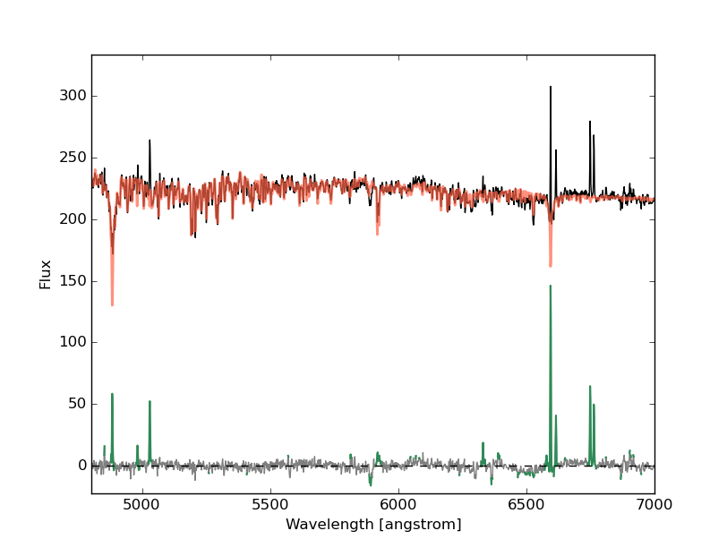
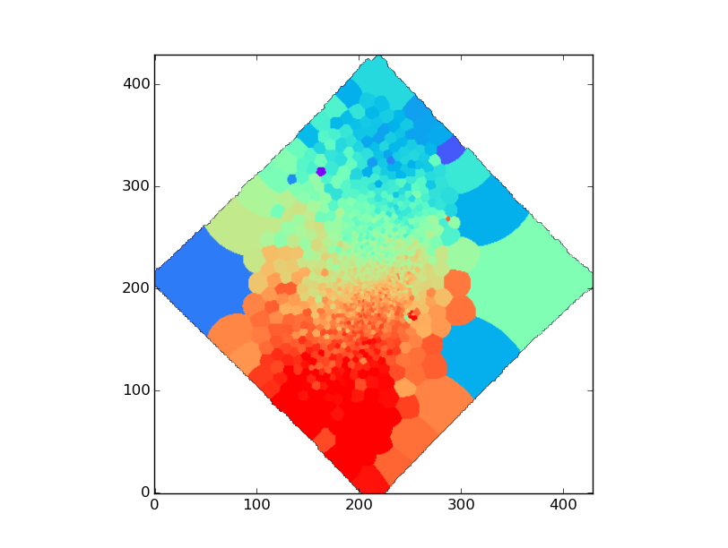
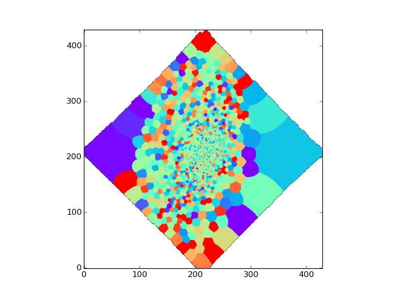

# pPXF

## Templates

In this package, template spectra for pPXF is assumed to be a collection of 1D FITS files.
One FITS file contains a spectrum of one template SED (either star or SSP). 
Each pixel value must be flux per unit wavelength and 
wavelength information must be properly stored in the FITS header 
keywords (`NAXIS1`, `CRPIX1`, `CRVAL`, and `CDELT1`). 

At this moment, [MILES](http://miles.iac.es/) SSP templates have been tested. 
One may want to use templates with higher spectral resolution for low sigma 
objects as MILES resolution is FWHM=2.51 angstrom, very close to the MUSE resolution.
[ELODIE](http://www.obs.u-bordeaux1.fr/m2a/soubiran/elodie_library.html) 
stellar library and SSP using it would be supported. 

Once you have prepared your template files, you need to make a list of them as follows.

```
$ head -10 miles_ssp_padova_all.list
ppxf_templates/MILES_Padova00_un_1.30/Mun1.30Zm0.40T00.0631_iPp0.00_baseFe.fits
ppxf_templates/MILES_Padova00_un_1.30/Mun1.30Zm0.40T00.0708_iPp0.00_baseFe.fits
ppxf_templates/MILES_Padova00_un_1.30/Mun1.30Zm0.40T00.0794_iPp0.00_baseFe.fits
ppxf_templates/MILES_Padova00_un_1.30/Mun1.30Zm0.40T00.0891_iPp0.00_baseFe.fits
ppxf_templates/MILES_Padova00_un_1.30/Mun1.30Zm0.40T00.1000_iPp0.00_baseFe.fits
ppxf_templates/MILES_Padova00_un_1.30/Mun1.30Zm0.40T00.1122_iPp0.00_baseFe.fits
ppxf_templates/MILES_Padova00_un_1.30/Mun1.30Zm0.40T00.1259_iPp0.00_baseFe.fits
ppxf_templates/MILES_Padova00_un_1.30/Mun1.30Zm0.40T00.1413_iPp0.00_baseFe.fits
ppxf_templates/MILES_Padova00_un_1.30/Mun1.30Zm0.40T00.1585_iPp0.00_baseFe.fits
ppxf_templates/MILES_Padova00_un_1.30/Mun1.30Zm0.40T00.1778_iPp0.00_baseFe.fits
```

## Run pPXF

One can run pPXF for Voronoi-binned spectra made in the previous step as follows.

```python
from pyezmad.mad_ppxf import run_voronoi_stacked_spectra_all

npy_prefix = 'ngc4980_pp'
npy_dir = 'pp_npy_out_sn50'

infile = '../stacking/ngc4980_voronoi_stack_spec_sn50.fits'

file_template_list = 'miles_ssp_padova_all.list'

run_voronoi_stacked_spectra_all(infile, npy_prefix, npy_dir=npy_dir,
                                temp_list=file_template_list,
                                vel_init=1400., sigma_init=40., dv_mask=400.,
                                wmin_fit=4800, wmax_fit=7000., n_thread=36,
                                FWHM_muse=2.51, FWHM_tem=2.51)
```

Here is a short descriptions for the input parameters.

* `infile` - input Voronoi binned spectra made in the previous step
* `npy_prefix` - pPXF result will be saved as a Numpy binary file with a name of `npy_dir/npy_prefix_%06i.npy`. For example, it will be `npy_dir/npy_prefix_000000.npy` and `npy_dir/npy_prefix_000100.npy` for 0-th and 100-th bins, respectively.
* `npy_dir` - a directory where the `.npy` files will be stored
* `temp_list` - a file name of the template list
* `vel_init` - initial guess of the line-of-sight velocity in km/s
* `sigma_init` - initial guess of the line-of-sight velocity dispersion in km/s
* `dv_mask` - +/-dv_mask km/s around strong emission lines will be masked during the fitting. In the current version, [OII], Hdelta, Hgamma, Hbeta, [OIII], [OI], [NII], Halpha, and [SII] are considered.
* `wmin_fit` - minimum wavelength to fit
* `wmax_fit` - maximum wavelength to fit
* `n_thread` - number of threads to be in parallel
* `FWHM_muse` - MUSE spectral resolution in angstrom (this must be implemented more accurately)
8 `FWHM_tem` - spectral resolution of templates in angstrom


## Check the result

```python
from pyezmad.mad_ppxf import show_output

import matplotlib.pyplot as plt
plt.ion()

ppxf_npy_dir = 'pp_npy_out_sn50'
ppxf_npy_prefix = 'ngc4980_pp'
voronoi_binspec_file = '../stacking/ngc4980_voronoi_stack_spec_sn50.fits'

# display 0th spectrum
show_output(0, voronoi_binspec_file, ppxf_npy_dir, ppxf_npy_prefix)
```



In this plot, a pPXF result for the 0th spectrum is shown. 
Black and red are the observed input spectrum and the best-fit, respectively. 
In the bottom, the residual is shown with grey and 
the masked pixels are indicated with green. 

At the same time, it will print the fitting result on the terminal.

```
=======================================================================
    Best Fit:       V     sigma        h3        h4        h5        h6
-----------------------------------------------------------------------
    Values       1.43e+03      35.5   -0.0229   -0.0305
    Errors           14.2      11.6     0.214    0.0831
    chi2/DOF         : 1.65
    Nonzero Templates: 6 / 350
-----------------------------------------------------------------------
```

## Extract kinematics into a table

You can create a table and arrays of velocities and velocity dispersions after pPXF run.

```
from pyezmad.mad_ppxf import ppxf_npy2array

ppxf_npy_prefix = 'ngc4980_pp'
ppxf_npy_dir = 'pp_npy_out_sn50'

tb_vel, bins, vel, sig, errvel, errsig = ppxf_npy2array(ppxf_npy_dir, ppxf_npy_prefix)
```

* `tb_vel` - `astropy.table.Table` object storing `bin`, `vel`, `errvel`, `sig`, and `errsig`
* `bins` - array storing bin IDs (just `np.arange(nbins)`)
* `vel` - line-of-sight velocity
* `errvel` - error in line-of-sight velocity
* `sig` - line-of-sight velocity dispersion
* `errsig` - error in line-of-sight velocity dispersion

Then the table can be saved as follows.

```python
tb_vel.write('ngc4980_ppxf_vel_sn50.fits', overwrite=True)
tb_vel.write('ngc4980_ppxf_vel_sn50.dat', format='ascii.fixed_width')
```

I made a (hopefully) convenient function to store these information 
in a multi-extension FITS file. 

```python
from pyezmad.voronoi import create_kinematics_image

file_segimg = 'ngc4980_voronoi_sn50_binimg.fits'
velimg, errvelimg, sigimg, errsigimg = \
    create_kinematics_image(fits.open(file_segimg),
                            tb_vel,
                            'ngc4980_ppxf_vel_sn50_img.fits')
```

You can open it as a multi-extension fits cube with ds9 as `ds9 -mecube ngc4980_ppxf_vel_sn50_img.fits`.

__Velocity map__ (nicely rotating!)


__Velocity dispersion map__ (constraints are not so good...)
