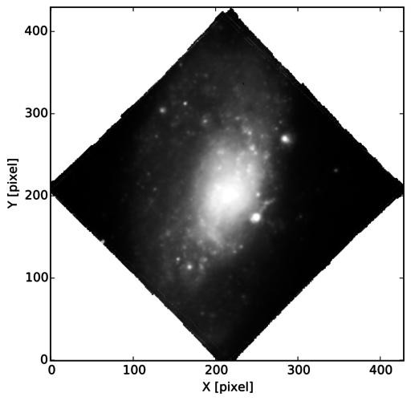

## White-light image

White-light image (i.e., just summing up the cube across the wavelength axis) 
can be made as follows.

```python
import os, os.path
import matplotlib.cm as cm

from pyezmad.utilities import create_whitelight_image

infile = '/net/astrogate/export/astro/shared/MAD/MUSE/P95/reduceddata/NGC4980/NGC4980_FINAL.fits'

wimage = create_whitelight_image('ngc4980_whitelight_image',
                                  wi_scale='asinh', wi_percent=99.5, wi_cmap=cm.Greys_r,
                                  is_plot=True)
```

This creates `ngc4980_whitelight_image.fits` and `ngc4980_whitelight_image.pdf` 
(I usually prefer PDF, but can be implemented later for other image formats). 
The resulting image is the following.



The white-light image will be used for subsequent analysis 
as a kind of geometry reference, so I recommend to make it. 
