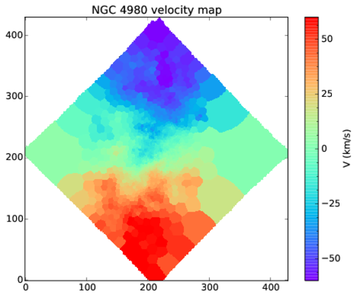
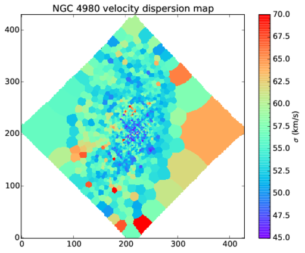

Emission line fitting
=====================

Continuum subtraction
---------------------

Continuum based on the pPXF best-fit can be subracted from the
Voronoi-binned spectra as follows.

.. code:: python

    from pyezmad.voronoi import subtract_ppxf_continuum_simple

    ppxf_npy_dir = 'pp_npy_out_sn50'
    ppxf_npy_prefix = 'ngc4980_pp'
    voronoi_binspec_file = 'ngc4980_voronoi_stack_spec_sn50.fits'
    outfile = 'ngc4980_voronoi_stack_sn50_emspec.fits'

    wave, var, flux, header = \
        subtract_ppxf_continuum_simple(voronoi_binspec_file,
                                       ppxf_npy_dir, ppxf_npy_prefix, outfile)

This create ``ngc4980_voronoi_stack_sn50_emspec.fits`` which has the
identical format to the input Voronoi-binned spectra. Note that the
wavelength range not fit by the pPXF run are filled with ``np.nan``.

Fitting
-------

Each emission line is assumed to be expressed as a Gaussian.

::

    from pyezmad.emission_line_fitting import emission_line_fitting

    linelist_name = [['Hbeta', 'OIII4959', 'OIII5007'], # these 3 lines are fit together
                     ['NII6548', 'NII6583', 'Halpha'],
                     ['SII6717', 'SII6731']]

    voronoi_binspec_file = '../ppxngc4980_voronoi_stack_sn50_emspec.fits'
    ppxf_output_file = 'ngc4980_ppxf_vel_sn50.fits'
    outfile = 'ngc4980_voronoi_out_emprop_sn50.fits'

    tbhdulist = emission_line_fitting(voronoi_binspec_file,
                                      ppxf_output_file,
                                      outfile,
                                      linelist_name,
                                      is_checkeach=False)

Emission lines grouped with a square bracket are fit simulataneously
assuming common line-of-sight velocity and velocity dispersion.
Therefore, emission lines must always be grouped even for a single line
fitting. If you want to fit a single line, the line list should be like
``linelist_name=[['Halpha']]``.

If you want to check each fitting, just set ``is_checkeach=True``.

Currently, the following line names are supported, but it's very easy to
extend.

.. code:: python

    # pyezmad/utilities.py
    linelist = {'OII3726'  : 3727.09,
                'OII3729'  : 3729.88,
                'H12'      : 3751.22,
                'H11'      : 3771.70,
                'H10'      : 3798.98,
                'H9'       : 3836.48,
                'NeIII3869': 3869.81,
                'H8'       : 3890.15,
                'NeIII3967': 3968.53,
                'Hepsilon' : 3971.19,
                'Hdelta'   : 4102.92,
                'Hgamma'   : 4341.69,
                'Hbeta'    : 4862.69,
                'OIII4959' : 4960.30,
                'OIII5007' : 5008.24,
                'NII6548'  : 6549.84,
                'NII6584'  : 6585.23,
                'Halpha'   : 6564.61,
                'SII6717'  : 6718.32,
                'SII6731'  : 6732.71,
                'NII5755'  : 5756.24,
                'OIII4363' : 4364.44,
                'OI6300'   : 6302.04,
                'HeI3889'  : 3889.75,
                'HeI5876'  : 5877.30,
                'HeI6678'  : 6679.996,
                # duplicated keys...
                'NII6583'  : 6585.23
                }

Output file (complicated...)
----------------------------

The output file ``'ngc4980_voronoi_out_emprop_sn50.fits`` has a bit
complicated format (any suggestion for improvement is welcome!). In each
extension stores the result for one of emission line groups. In the
above example, there are three extensions named ``GROUP0``, ``GROUP1``,
and ``GROUP2``. The first extension (``GROUP0``) stores the fitting
result for the first emission line group. Available keys are
``f_<line>`` and ``ef_<line>`` as flux and error in flux for each line,
common velosity and sigma with correponding errors (``vel``, ``sig``,
``errvel``, and ``errsig``). Information on the continuum (assumed to be
2nd order polynomial) are also stored as ``cont_a``, ``cont_b``, and
``cont_c``, and the continuum can be reprodudec with
``cont_a * x**2 + cont_b * x + cont_c``. Chi-square and reduced
chi-square are available as ``chisqr`` and ``redchi``.

Yes, it's complicated, but I made a funciton to know which keys you
should look at to extract proper information.

.. code:: python

    from pyezmad.emission_line_fitting import search_lines

    hdu = fits.open('ngc4980_voronoi_out_emprop_sn50.fits')
    extname, keyname = search_lines(hdu, ['Hbeta', 'OIII5007', 'Halpha', 'NII6583'])

With these infomation, you can obtain, for example, Halpha flux with
``hdu[extname['Halpha']].data['f_Halpha']``.

There resulting velocity field is the following.

**Velocity map**

   Halpha velocity map

**Velocity dispersion map**

   Halpha velocity dispersion map
