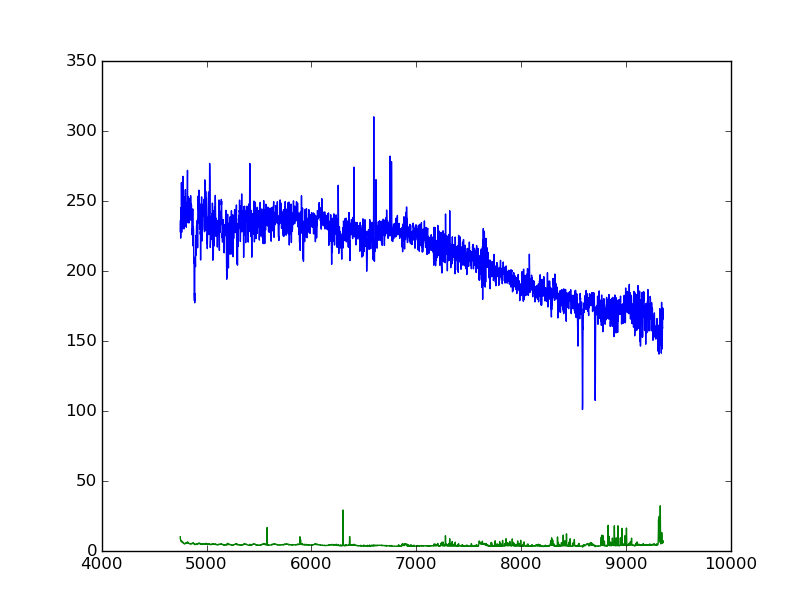

Stacking of spectra
===================

One can stack spectra according to the Voronoi binning in the previous
step.

.. code:: python

    from pyezmad.voronoi import stacking

    infile= '/net/astrogate/export/astro/shared/MAD/MUSE/P95/reduceddata/NGC4980/NGC4980_FINAL.fits'

    stacking( infile, # input MUSE cube
             'ngc4980_voronoi_xy2bin_sn50.fits',  # mapping information
             'ngc4980_voronoi_stack_spec_sn50.fits') # output FITS file

| The output FITS file ``ngc4980_voronoi_stack_spec_sn50.fits`` has a
  shape of ``(nbin, nwave)`` where ``nbin`` is the number of Voronoi
  bins and ``nwave`` is the number of wavelength pixels, i.e.,
  ``NAXIS3`` keyword in the input cube. The spectra is per pixel unit,
  i.e., average of Npix in each bin.
| In the future, the unit will be flux per square arcsec, for instance.
  The first (``FLUX``) and second (``VAR``) extensions contain flux and
  variance of the stacked spectra, respectively.

For instance, one can display a spectrum at i-th bin as follows.

.. code:: python

    import numpy as np
    import astropy.io.fits as fits
    import matplotlib.pyplot as plt

    plt.ion()

    i_bin = 10

    hdu = fits.open('ngc4980_voronoi_stack_spec_sn50.fits')
    h = hdu['FLUX'].header
    w = h['CRVAL1']+h['CDELT1']*(np.arange(h['NAXIS1'])-h['CRPIX1']+1)
    plt.plot(w, hdu['FLUX'].data[i_bin,:], '-')
    plt.plot(w, np.sqrt(hdu['VAR'].data[i_bin,:]), '-')

   Example spectrum
