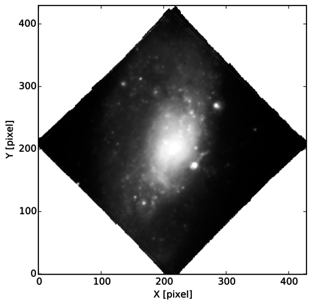

White-light image
=================

White-light image (i.e., just summing up the cube across the wavelength
axis) can be made as follows.

.. code:: python

    import os, os.path
    import matplotlib.cm as cm

    from pyezmad.utilities import :py:meth:`create_whitelight_image`

    infile = '/net/astrogate/export/astro/shared/MAD/MUSE/P95/reduceddata/NGC4980/NGC4980_FINAL.fits'

    wimage = create_whitelight_image(infile, 'ngc4980_whitelight_image',
                                      wi_scale='asinh', wi_percent=99.5, wi_cmap=cm.Greys_r,
                                      is_plot=True)

This creates ``ngc4980_whitelight_image.fits`` and
``ngc4980_whitelight_image.pdf`` (I usually prefer PDF, but can be
implemented later for other image formats). The resulting image is the
following.

   NGC4980 white-light image

The white-light image will be used for subsequent analysis as a kind of
geometry reference, so I recommend to make it.
