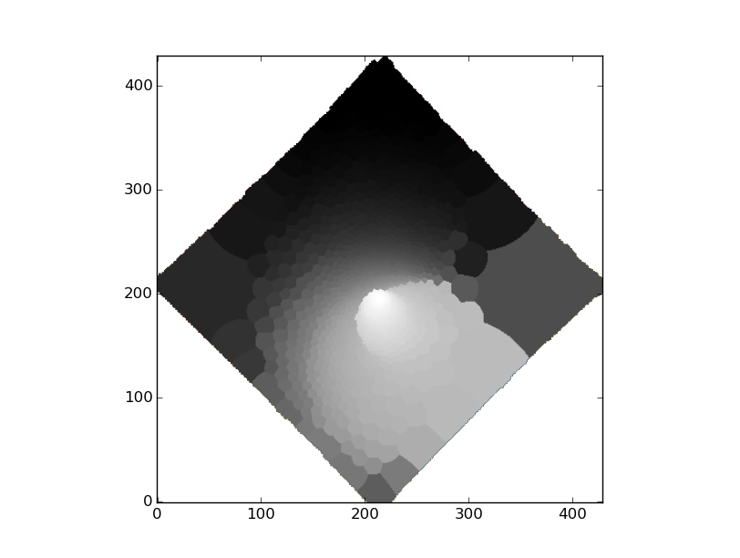
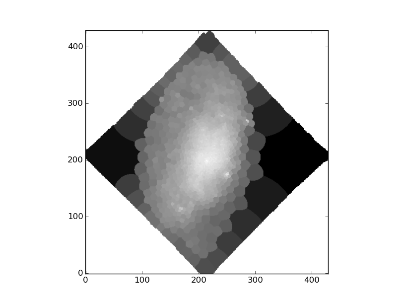

# Voronoi 2D binning

## Voronoi tesselletion

Voronoi 2D binning can be done as follows.

```python
import os, os.path
from pyezmad.voronoi import run_voronoi_binning

infile = '/net/astrogate/export/astro/shared/MAD/MUSE/P95/reduceddata/NGC4980/NGC4980_FINAL.fits'
outprefix = 'ngc4980_voronoi'

targ_sn_ratio = 50

out_fits_xy2bin, out_fits_bininfo = \
    run_voronoi_binning(infile, outprefix,
                        wave_center=5700., dwave=50., target_sn=targ_sn_ratio)
``` 

You need to specify a target S/N per angstrom (`target_sn`) and 
wavelength range (`wave_center`, `dwave`) in which signal and noise will be computed.
Note that the S/N is assumed to be an integer and 
the wavelength here is in the observed frame in angstrom.

The above procedure creates four output file. ASCII files are mainly to check the results and FITS files are used for further analysis. 

* `ngc4980_voronoi_bininfo_sn50.{dat,fits}` - contain information to map (x,y) pixels to Voronoi bins. X, Y, and bin ID start from zero. 
* `ngc4980_voronoi_xy2bin_sn50.{dat,fits}` - contain inforation for each Voronoi bin. 
    * `bin` -  bin ID
    * `xnode` - X coordinate of the geometrical center of a Voronoi cell
    * `ynode` - Y coordinate of the geometrical center of a Voronoi cell
    * `xcen` - X coordinate of the luminosity weighted center of a Voronoi cell
    * `ycen` - Y coordinate of the luminosity weighted center of a Voronoi cell
    * `sn` - S/N ratio after the Voronoi binning
    * `npix` - Number of pixels in each Voronoi cell
    * `scale` - Scale length of the weighted Voronoi tessellation (not important here)


## Create a Voronoi segmentation image

You may want to make an image showing which pixels on 2D correspond to Voronoi bins.

```python
import numpy as np
import astropy.io.fits as fits
from pyezmad.voronoi import create_segmentation_image

refimg_fits = '../whiteimage/ngc4980_whiteimage.fits' # reference image
tb_xy_fits = 'ngc4980_voronoi_xy2bin_sn50.fits'
tb_bin_fits = 'ngc4980_voronoi_bininfo_sn50.fits'

outprefix = 'ngc4980_voronoi_sn50'

segimg = create_segmentation_image(tb_xy_fits, refimg_fits)

fits.writeto(outprefix + '_segimg.fits', segimg, fits.getheader(refimg_fits))
```

The resulting FITS image can be displayed with DS9 with pixel values 
showing the bin IDs. It looks like this.
Bins with white colors contains less number of pixels and vice versa.




## Create a Voronoi-segmented image with bin's properites

If you have an array containing some values (velocity, velocity dispersion, flux, etc.), 
you can make a Voronoi-segmented map of it as follows.  

In this case, note that array indexes corresponds to the bin IDs.

```python
from pyezmad.voronoi import create_value_image

npiximg = create_value_image(fits.getdata('ngc4980_voronoi_sn50_segimg.fits'), # segmentation map
                             fits.getdata(tb_bin_fits)['npix']) # values to be reconstructed
fits.writeto(outprefix + '_npiximg.fits', npiximg, fits.getheader(refimg_fits))
```

This image shows log10(Npix) at each pixel. 



